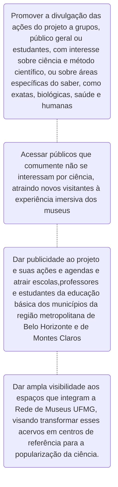
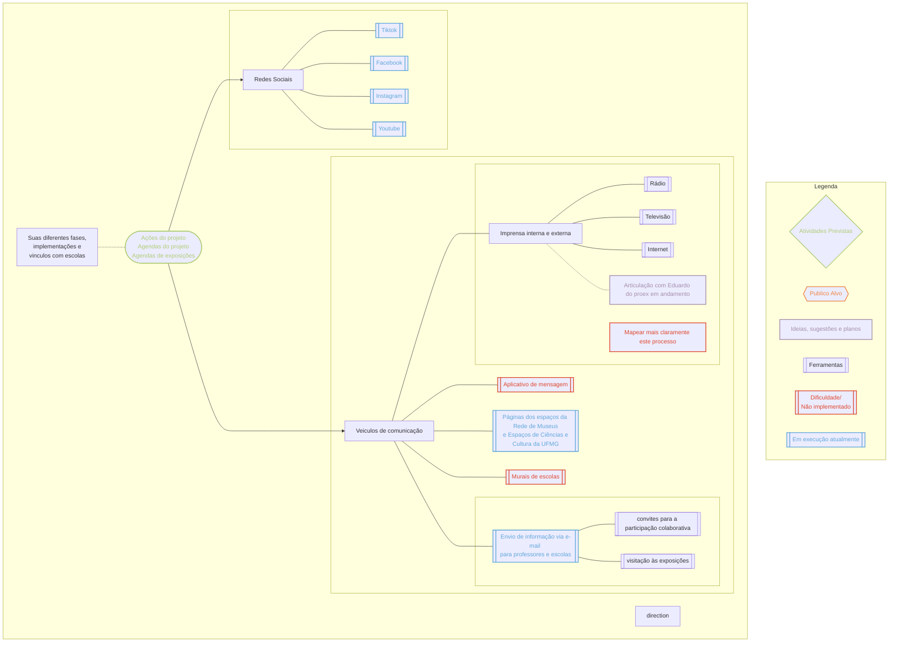
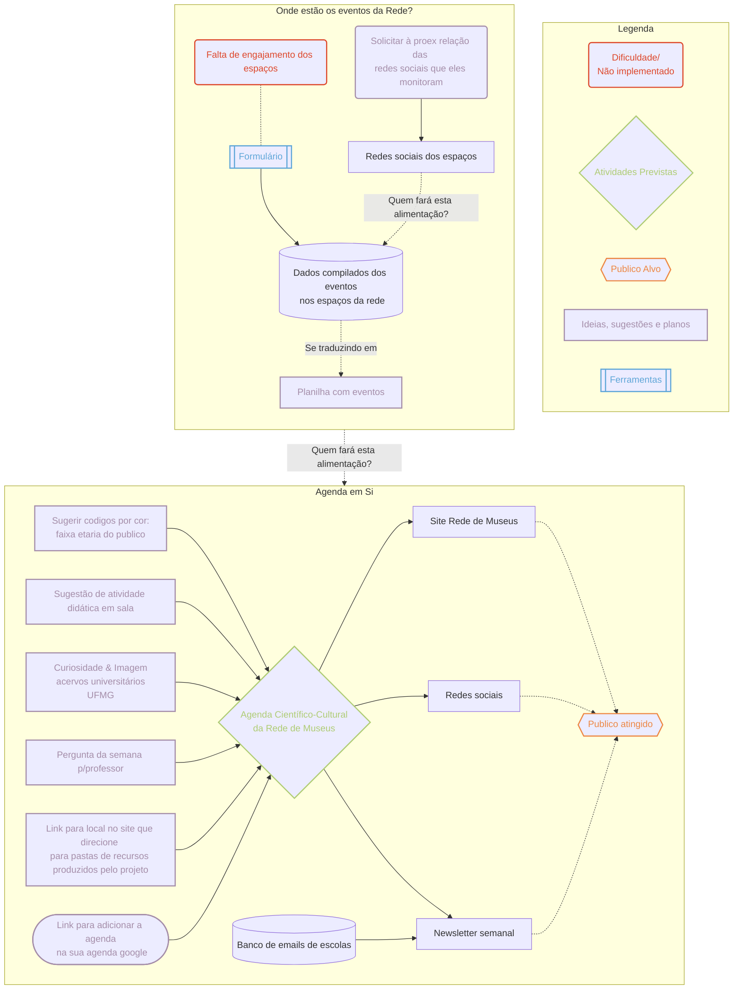
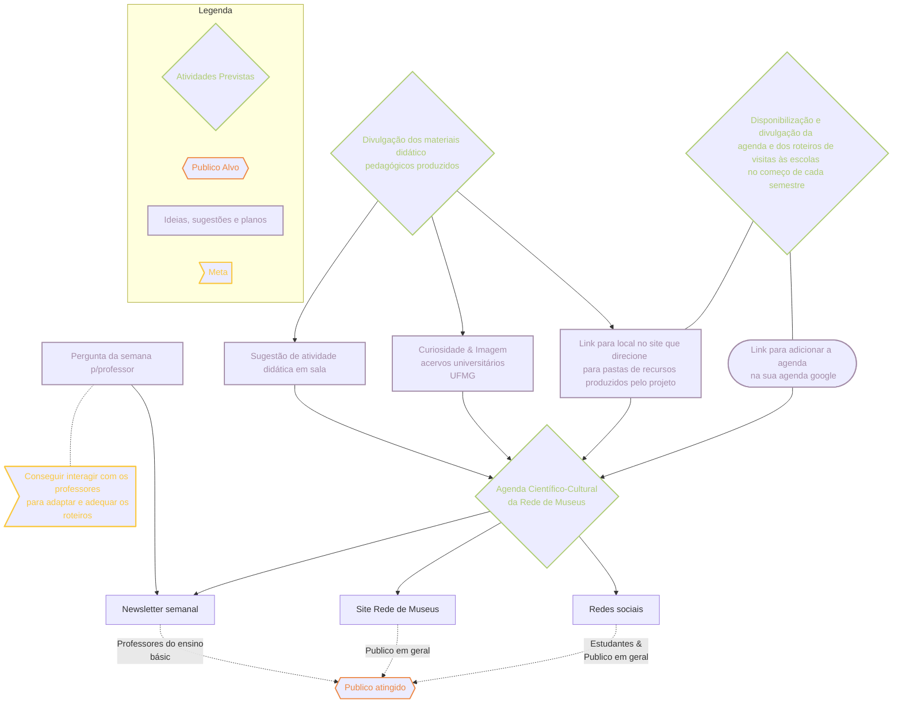

---
{"dg-publish":true,"permalink":"/02-produtos/apresentacao-do-projeto-para-professores/","tags":["mdc"],"created":"2023-08-07 às 10:33","updated":"2023-08-07 às 11:08"}
---

## A.1.1 Objetivo

1. Promover a **divulgação das ações do projeto a grupos, público geral ou estudantes**, com **interesse sobre ciência e método científico, ou sobre áreas específicas do saber,** como exatas, biológicas, saúde e humanas; </br>

2. **Acessar públicos que comumente não se interessam por ciência**, atraindo **novos visitantes** à experiência imersiva dos museus;</br>
<center> <font color="#8064a2">Como? | Falta de acesso aos espaços: portarias, rotas acessíveis, etc</font></center>

4. Dar publicidade ao projeto e suas ações e agendas e atrair escolas, professores e estudantes da educação básica dos municípios da região metropolitana de Belo Horizonte e de Montes Claros; ✅ 🏗️
	- Várias frentes → Estação Ecologica, UFMG Jovem, Contato direto com escolas<br>
5. Dar **ampla visibilidade** aos espaços que integram a Rede de Museus UFMG, **visando transformar esses acervos em centros de referência para a popularização da ciência**.
	- <font color="#8064a2">Ampla visibilidade não deveria ser atingir o status de viral, mas fazer um básico bem feito acessível a todos os públicos</font>
		- <font color="#8064a2">Design Acessível nas postagens de redes sociais e blogs</font>
			- <font color="#8064a2">Bibliografia → Produzir guia de postagens</font>
			- <font color="#8064a2">O quê do nosso material escrito pode ser disponibilizado com narração</font>
			- <font color="#8064a2">Adaptação em braile, inclusive para escolas terem em suas bibliotecas</font>
			- <font color="#8064a2">Áudio-descrição de itens dos acervos, disponibilização no site e uso permanente</font>
			- <font color="#8064a2">Revisão sensível</font>
		- <font color="#8064a2">Acredito poder ajudar em conjunto com o NAI </font>
		- <font color="#8064a2">Design que não se torne obsoleto e seja fácil de acessar e compreender. </font>

   



***

## A.1.2 Público Alvo

  

O projeto atuará em **duas frentes: população em geral**, que busca lazer e conhecimento nos museus; e **estudantes e professores do ensino básico nos municípios da região metropolitana de Belo Horizonte e de Montes Claros.**

```mermaid 
graph TB
accTitle: Desenho de publico alvo
accDescr {O projeto atuará em duas frentes: população em geral, que busca lazer e conhecimento nos museus; e estudantes e professores do ensino básico nos municípios da região metropolitana de Belo Horizonte e de Montes Claros.}
O{{Publico alvo}}:::publicoAlvo
O --> id3{{População Geral}}:::publico
O --> id6{{Ensino básico}}
id7[ Municípios da região metropolitana<br> de Belo Horizonte e de Montes Claros.] 
id6 --> id8{{Estudante}}:::publico
id6 --> id9{{Professor}}:::publico
id3 -.- id4[\lazer\]
id3 -.- id5[\conhecimento\]
id8 --> id10[Tem também demandas <br>especificas por faixa etária]
id9 --> id11[Tem também demandas<br> didáticas/pedagógicas]
classDef publicoAlvo stroke:#ed8743,stroke-width:2px, color:#ed8743
classDef publico stroke:#ed8743,stroke-width:2px, 
```
___

## A.1.3 Atividades previstas

### Promoção de **divulgação das diferentes fases do projeto em mídias sociais e veículos de comunicação, destacando sua implementação, vínculo com escolas e agenda de exposições**; 



### Produção e divulgação de semanal, às sextas-feiras, de Agenda Científico-Cultural da Rede de Museus, divulgada em redes sociais, site e enviada em **Newsletter semanal** com banco de e-mails de escolas das regiões;





Divulgação dos materiais didático-pedagógicos produzidos.


***
## A.1.4 Metas

  

- Alcançar e interagir com público amplo interessado ou não em ciências; 
	- <font color="#5f497a">Produzindo conteúdo cativante e interessante para redes sociais</font>
		- <font color="#5f497a">Curiosidade & Imagem acervos universitários UFMG</font>
		- <font color="#5f497a">Link para adicionar a agenda na sua agenda google</font>
- Promover o desejo e a ação de se visitar as exposições;
    - <font color="#5f497a">Imagens dos espaços nas redes sociais</font>
	    - <font color="#5f497a">Bolsistas das redes sociais precisam visitar e fazer imagens</font>
- Conhecer o modelo de divulgação mais funcional para os diferentes públicos;
    -<font color="#5f497a"> Vamos evitar o Modelo de Déficit e partir de pontos mais inclusivos e dialógicos</font>
    - <font color="#5f497a">Hearts, Mind & Hands on</font>
- Aperfeiçoar a divulgação das exposições e roteiros ao longo do projeto;
    - <font color="#5f497a">Previsto com as bolsistas depois de volume a definir de respostas aos formulários de avaliação</font>
- Alcançar as escolas e os professores das regiões dos museus;
    - Previsto o fluxo de visitantes da Estação Ecologica
	    - BH e Mariana
	- Previsto o fluxo UFMG Jovem 
	- Newsletter
- Conseguir interagir com os professores para adaptar e adequar os roteiros e as datas e horários das visitas à demanda das turmas;
	-  Formulários de avaliação
	- <font color="#5f497a">Pergunta da semana p/professor</font>
- Atrair e viabilizar a visitação por grande número de turmas escolares; 
    - Previsto o fluxo de visitantes da Estação Ecológica
	    - BH e Mariana
	- Previsto o fluxo UFMG Jovem 
- Acessar públicos distintos e promover a participação nos tours virtuais de educação científica;
	- Aguardando viabilização dos vídeos
	- <font color="#5f497a">Disponibilização de todos os materiais executados pelo projeto em "diferentes linguagens"</font>
		- <font color="#5f497a">Material didático bruto para professores</font>
		- <font color="#5f497a">Imagens usadas disponibilizadas ao grande público</font>
		- <font color="#5f497a">Postagens didáticas & Interativas nas redes sociais sobre conteúdo</font>
- Divulgar os materiais didático-pedagógicos produzidos e promover meios para que o público potencial (professores) tenha informação e acesso;
	- <font color="#5f497a">Pasta organizada por tema no google drive</font>
	- <font color="#5f497a"> Link disponível em todas as postagens (redes e blog)</font>
	- <font color="#5f497a">Newsletter</font>
- Divulgação do desenvolvimento conceitual e dos processos para público científico.
	- <font color="#5f497a">Disponibilização desta apresentação (omitindo alguns planejamentos, melhorando algumas coisas)</font>
	- <font color="#5f497a">Disponibilizando newsletter2 - quinzenal, com foco nas ações do projeto para divulgação interna</font>
	- <font color="#5f497a">Execução da newsletter1 para professores</font>

---

## A.1.6 Produtos

  

1. Publicação de vídeos, folders e conteúdos adaptados para as mídias sociais;
    
2. Publicação de materiais didáticos, livretos, cartilhas, catálogo das exposições a serem realizadas nos espaços da rede;
    
3. Impressão e distribuição de cartazes e folders em murais de escolas;
    
4. Elaboração e divulgação de vídeos Pitch para público amplo e comunidade escolar;
    
5. Entrevistas em veículos de imprensa;
    
6. Produção de textos para revistas de divulgação científica/tecnológica;
    
7. Apresentação de trabalhos em congressos científicos
    
8. Elaboração de Produtos científicos (artigo) sobre essa experiência;
    

___

## A.1.7 Indicadores de Avaliação

  

1. Número de produtos divulgados a cada semana;
	- Mapear como contabilizar
		- Insta + Facebook + Tiktok + YouTube em 1 só lugar
		- Data/hora titulo
    
2. Número de visitas a nossas páginas web e número e participantes de nossas redes sociais;
	- Numero de visitas a paginas web por analitycs
	- Participantes de redes sociais (como? ir anotando o crescimento!)
1. Engajamento nas redes sociais;
	- Pensar como contabilizar - bibliografia que escreva a metodologia 
1. Interação por diferentes canais de comunicação: redes sociais e<font color="#5f497a"> aplicativos de mensagens</font>;
	- <font color="#5f497a">Pergunta da semana p/professor - Newsletter</font>
	- <font color="#5f497a">Perguntas nos stories</font>
	- Interações por diversas redes
<font color="#f79646">1. Número de visitantes de amplo público e curva de visitação ao longo do mês;</font>

<font color="#f79646">6. Número de alunos e professores visitantes das exposições e curva de visitação ao longo do mês;</font>
    
7. Avaliação pelos participantes. 
	- Ocorrendo pelos formulários
1. Número de professores formados nas oficinas de educação científica;
    
9. Download dos materiais didático-pedagógicos;
    - Criação de pasta e metodo de organização
10. Número de artigos e resumos publicados.
    
